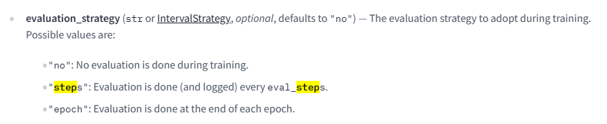
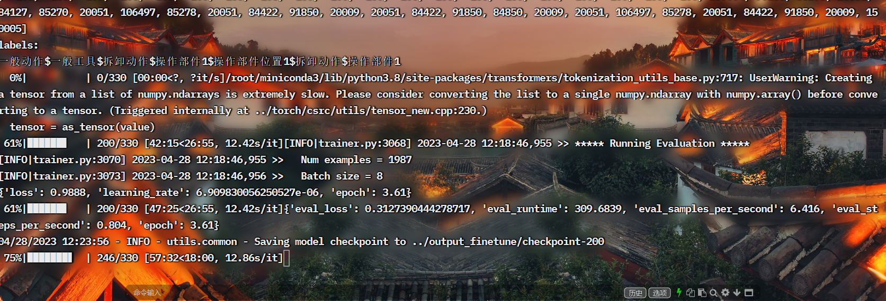

# 					ChatGLM实战信息抽取（ner）

​	声明：资料来自互联网，非原创，禁止用于商用 ，致敬原作者郑先生。

​	代码地址：

​	原作地址：https://github.com/hiyouga/ChatGLM-Efficient-Tuning

## 一、数据集

### 1.1、基准数据集

​	（1）目前我们实现了针对以下数据集的支持：[Stanford Alpaca](https://github.com/tatsu-lab/stanford_alpaca)，[Stanford Alpaca (Chinese)](https://github.com/ymcui/Chinese-LLaMA-Alpaca)，[GPT-4 Generated Data](https://github.com/Instruction-Tuning-with-GPT-4/GPT-4-LLM)，[BELLE 2M](https://huggingface.co/datasets/BelleGroup/train_2M_CN)，[BELLE 1M](https://huggingface.co/datasets/BelleGroup/train_1M_CN)，[BELLE 0.5M](https://huggingface.co/datasets/BelleGroup/train_0.5M_CN)，[BELLE Dialogue 0.4M](https://huggingface.co/datasets/BelleGroup/generated_chat_0.4M)，[BELLE School Math 0.25M](https://huggingface.co/datasets/BelleGroup/school_math_0.25M)，[BELLE Multiturn Chat 0.8M](https://huggingface.co/datasets/BelleGroup/multiturn_chat_0.8M)，[Guanaco Dataset](https://huggingface.co/datasets/JosephusCheung/GuanacoDataset)，[Firefly 1.1M](https://huggingface.co/datasets/YeungNLP/firefly-train-1.1M)，[CodeAlpaca 20k](https://huggingface.co/datasets/sahil2801/CodeAlpaca-20k)，[Alpaca CoT](https://huggingface.co/datasets/QingyiSi/Alpaca-CoT)，[Web QA (Chinese)](https://huggingface.co/datasets/suolyer/webqa)

​	（2）关于数据集文件的格式，请参考 [data/standard/README.md](data/README.md) 文件。构建自定义数据集时，既可以使用单个 `.json` 文件，也可以使用一个[数据加载脚本](https://huggingface.co/docs/datasets/dataset_script)和多个文件。

### 1.2、自定义数据集

​	自定义数据格式是有要求的，如果是采用多轮问答需要按照以下格式。

```
[
   {
        "instruction": "你现在是一个命名实体识别模型，请你帮我判断一下文本存在那些类别，这些类别包括'安装动作','操作部件位置1','方位','目标部件位置1','操作程序选项','一般动作','操作部件位置2','目标部件2','物理量','目标部件位置2','量词','工作区域','拆卸动作','操作程序','目标部件1','操作部件2','操作部件1','一般工具',类别之间用'$'分割。",
        "input": "使用冷却液连接器拆卸工具，松开将冷却液输入管固定到功率转换系统的夹子，并从功率转换系统上拆下导管。请参阅管路输入冷却液功率转换系统。",
        "output": "一般动作$一般工具$拆卸动作$操作部件1$操作部件位置1$拆卸动作$操作部件1",
        "history": [
            [
                "",
                ""
            ],
            [
                "",
                ""
            ]
        ]
    },
    {
        "instruction": "你现在是一个命名实体识别模型，请你帮我判断一下句子中，名词类别为'一般动作'有哪些名词？,用'$'分割",
        "input": "使用冷却液连接器拆卸工具，松开将冷却液输入管固定到功率转换系统的夹子，并从功率转换系统上拆下导管。请参阅管路输入冷却液功率转换系统。",
        "output": "使用",
        "history": [
            [
                "你现在是一个命名实体识别模型，请你帮我判断一下文本存在那些类别，这些类别包括'安装动作','操作部件位置1','方位','目标部件位置1','操作程序选项','一般动作','操作部件位置2','目标部件2','物理量','目标部件位置2','量词','工作区域','拆卸动作','操作程序','目标部件1','操作部件2','操作部件1','一般工具',类别之间用'$'分割。文本为：使用冷却液连接器拆卸工具，松开将冷却液输入管固定到功率转换系统的夹子，并从功率转换系统上拆下导管。请参阅管路输入冷却液功率转换系统。",
                "一般动作$一般工具$拆卸动作$操作部件1$操作部件位置1$拆卸动作$操作部件1"
            ],
            [
                "",
                ""
            ]
        ]
    },
    {
        "instruction": "你现在是一个命名实体识别模型，请你帮我判断一下句子中，名词为'使用',起始位置和终止位置分别是什么？,用'$'分割",
        "input": "使用冷却液连接器拆卸工具，松开将冷却液输入管固定到功率转换系统的夹子，并从功率转换系统上拆下导管。请参阅管路输入冷却液功率转换系统。",
        "history": [
            [
                "你现在是一个命名实体识别模型，请你帮我判断一下文本存在那些类别，这些类别包括'安装动作','操作部件位置1','方位','目标部件位置1','操作程序选项','一般动作','操作部件位置2','目标部件2','物理量','目标部件位置2','量词','工作区域','拆卸动作','操作程序','目标部件1','操作部件2','操作部件1','一般工具',类别之间用'$'分割。文本为：使用冷却液连接器拆卸工具，松开将冷却液输入管固定到功率转换系统的夹子，并从功率转换系统上拆下导管。请参阅管路输入冷却液功率转换系统。",
                "一般动作$一般工具$拆卸动作$操作部件1$操作部件位置1$拆卸动作$操作部件1"
            ],
            [
                "你现在是一个命名实体识别模型，请你帮我判断一下句子中，名词类别为'一般动作'有哪些名词？,用'$'分割文本为：使用冷却液连接器拆卸工具，松开将冷却液输入管固定到功率转换系统的夹子，并从功率转换系统上拆下导管。请参阅管路输入冷却液功率转换系统。",
                "使用"
            ]
        ],
        "output": "起始位置:0,终止位置:2"
    }

]
```

	注：如果是长度为n轮的问答,例如n=3，这里需要注意history类型为list,长度为n-1=2, 即为[ [""，""],  ["",""]] 或[ ["aaa"],  ["",""]]或[ ["aaa"],  ["bbb"]]的形式。在最里面那层[]里存放着[’前一轮问题‘，’前一轮答案‘]。
## 二、微调方式

​	作者这里列举了以下三种微调方式，目前我们实现了针对以下高效微调方法的支持：

### 2.1、LoRA 

​		论文：https://arxiv.org/abs/2106.09685

​		源码：https://github.com/microsoft/LoRA

​		博客：https://finisky.github.io/lora/

​		LoRA 全称Low-Rank Adaptation of Large Language Models ，lora建议冻结预训练模型的权重，并在每个transformer块中注入 可训练层，即秩分解矩阵。因为不需要为大多数模型计算权重梯度，所以大大减少了需要 训练参数的数量，从而降低了 GPU的内存要求。研究人员发现，通过聚焦大模型的 Transformer 注意力块，使用 LoRA 进行的微调质量与全模型微调相当，同时速度更快且需要更少的计算。在引入lora之前也采用过adapters和prefix-Tune，但Adapters引入额外的推理延迟 (由于增加了模型层数)，Prefix-Tuning则难于训练，且预留给prompt的序列挤占了下游任务的输入序列空间，影响模型性能。相比之下，LoRA的优势是容易训练。


​	Lora的思想很简单，就是在原始PLM旁边增加一个旁路，做一个降维再升维的操作，来模拟所谓秩排序（intrinsic rank）。训练的时候，固定PLM的参数，只训练训练降低矩阵A与升维矩阵B。而模型的输入输出维度不变，输出时BA与PLM的参数叠加。用随机高斯分布初始化A，用0矩阵初始化B，保证训练的时候此旁路矩阵依然是0矩阵。这种思想有点类似与残差接链接，同时使用这个旁路的更新来模拟全量微调的过程。全量微调可以看作lora的一个特例。

​	总之一句话：lora基于大模型的内在低秩特性，增加旁路矩阵来模拟全模型参数微调，LoRA通过简单有效的方案来达成轻量微调的目的。

## 2.2、P-Tuning V2

​		论文：https://arxiv.org/abs/2110.07602		

​		源码：https://github.com/THUDM/P-tuning-v2

​		博客：https://zhuanlan.zhihu.com/p/425565773，https://zhuanlan.zhihu.com/p/453535678

​		结论：P-tuning v2在300M到10B的不同模型尺度上，以及在诸如问题回答和序列标注等各种NLU硬任务上，都具有匹配的微调性能。**与微调相比，P-tuning v2为每个任务提供了0.1%到3%的可训练参数**，这大大降低了训练时间的记忆成本和每个任务的存储成本。

### 2.1、prompt tuning 

​		prompt tuning 在主干语言模型参数被冻结时，引入了可训练的连续提示来替代NLU的自然语言提示。

​		例如，电影评论x =“Amazing movie!”分类为积极或消极，很自然地会想到向评论添加提示“it is [MASK]”，并生成面具标记被预测为“好”或“坏”的条件概率作为分类。在本例中，提示符{"It"，“is”，“[MASK]”}属于模型的词汇表V，输入嵌入序列为[e(x)， e("It")， e("is")， e(" MASK ")]。然而，由于模型M本质上是连续的，从优化的角度来看，离散自然提示永远无法达到最优。

​		相反，p-tuning 提出用可训练的连续嵌入替换提示符号[h0，…,hi]，并将输入序列转换为[e (x), h0,…,hi, e(“[MASK]”)]。因此p-tuning 可以进行差异优化。在主要的预训练模型参数被冻结的严格约束下，在简单的NLU任务中，对于100亿参数的模型 Prompt-tuning 已被证明具有与微调相当的性能。

### 2.2、P-Tuning v2

#### 2.2.1、核心知识

​		（1）在许多NLP应用程序中，Prompt tuning和P-tuning已经被证明是非常有效的。然而，考虑到以下缺乏普遍性，ptuning还不是微调的全面替代方案。

​		（2）prompt tuning 存在以下缺点：缺乏跨尺度普遍性，在小模型(100M to 1B) 上效果差异显著；在序列标注的任务上，难任务上ptuning 表现一般。

​		（3）Prompt Tuning分为两种形式，可分为两种即p_tuning和p_tuning_v2。前者P-Tuning仅对大模型的Embedding加入新的参数，P-Tuning-V2，将大模型的Embedding和每一层前都加上新的参数。

#### 2.2.2、参数说明

​		（1）当prefix_projection为True时，为P-Tuning-V2方法，在大模型的Embedding和每一层前都加上新的参数；为False时，为P-Tuning方法，仅在大模型的Embedding上新的参数。

​		（2）`PRE_SEQ_LEN` 和 `LR` 分别是 soft prompt 长度和训练的学习率，可以进行调节以取得最佳的效果。

​		（3）P-Tuning-v2 方法会冻结全部的模型参数，可通过调整 `quantization_bit` 来被原始模型的量化等级，不加此选项则为 FP16 精度加载。

### 2.3、Freeze

​		论文：https://arxiv.org/abs/2012.14913	

​		博客：[Transformer Feed-Forward Layers Are Key-Value Memories](https://zhuanlan.zhihu.com/p/611278136)，[大型语言模型系列解读（二）：Transformer中FFN的记忆功能 ](https://zhuanlan.zhihu.com/p/604739354)

​		Freeze方法，即参数冻结，对原始模型部分参数进行冻结操作，仅训练部分参数，以达到在单卡或不进行TP或PP操作，就可以对大模型进行训练。

​		项目中核心代码如下所示：

```python
        for name, param in model.named_parameters():
            if not any(trainable_layer in name for trainable_layer in finetuning_args.trainable_layers):
                param.requires_grad_(False)
            else:
                param.data = param.data.to(torch.float32) 
```


## 三、配置环境

```
torch==1.13.1+cu116
accelerate==0.17.1
torchvision==0.14.1+cu116
tqdm==4.65.0
rouge_chinese==1.0.3
psutil==5.9.2
huggingface_hub==0.13.2
transformers==4.27.4
matplotlib==3.6.1
datasets==2.10.1
jieba==0.42.1
nltk==3.7
numpy==1.23.3
bitsandbytes==0.37.0
dataclasses==0.8
diffusers==0.15.1
evaluate==0.4.0
parameterized==0.9.0
Pillow==9.5.0
PyGithub==1.58.1
pytest==7.3.1
wandb==0.15.0
```

注意：peft包要从[githup peft](github.com/huggingface/peft.git )下载安装包，然后用python set.py install 进行安装。

## 四、如何使用

​	目前代码在原作者的基础上增加同时训练和推理功能，增加预测部分增加预测结果保存功能，优化数据history等  。

### 4.1、单卡微调

```bash
CUDA_VISIBLE_DEVICES=0 nohup python finetune.py \
    --model_name_or_path /root/autodl-fs/chatglm-6b_model\
    --do_train \
    --do_eval \
    --evaluation_strategy "steps" \
    --eval_steps 200 \
    --metric_for_best_model "eval_loss" \
    --load_best_model_at_end \
    --dataset dev_examples,train_examples \ # 支持多个文件用英语逗号隔开，这里代码已经改过来只能上传训练集和验证集各一个
    --dataset_dir /root/autodl-tmp/chatglm_efficient_tune/data/my_data \
    --finetuning_type p_tuning \
    --prefix_projection \
    --output_dir ../output_finetune \
    --overwrite_cache \
    --per_device_train_batch_size 6 \
    --gradient_accumulation_steps 6 \
    --lr_scheduler_type cosine \
    --logging_steps 200 \
    --save_steps 200 \
    --max_train_samples 2000 \
    --learning_rate 2e-5 \
    --num_train_epochs 6.0 \
    --fp16
```



​		transformers.trainer类中，evaluation_strategy参数表示在训练的时候是否进行验证，按照什么方式进行验证。传入参数(默认值)为no时，不进行验证，如果是steps时，即按照step进行验证，如果是epoch时，则按照epoch进行验证。

### 4.2、单卡推理

```
CUDA_VISIBLE_DEVICES=0 python finetune.py \
    --do_eval \
    --model_name_or_path /root/autodl-fs/chatglm-6b_model\
    --dataset dev_examples \
    --checkpoint_dir ./output_finetune/checkpoint-2000 \
    --output_dir eval \
    --per_device_eval_batch_size 8 \
    --max_eval_samples 3600 \
    --predict_with_generate
```

关于参数信息，请查阅[维基](https://github.com/hiyouga/ChatGLM-Efficient-Tuning/wiki/Usage#fine-tuning)。

### 4.3、多卡分布式微调

```bash
accelerate config # 首先配置分布式环境
accelerate launch python src/finetune.py # 参数同上
```

注意：若您使用 LoRA 方法进行微调，请指定以下参数 `--ddp_find_unused_parameters False` 来避免报错。

### 4.4、效果测试

```bash
CUDA_VISIBLE_DEVICES=0 python src/infer.py \
    --checkpoint_dir path_to_checkpoint
```

### 4.5、部署微调模型

```python
from .src import load_pretrained, ModelArguments
model_args = ModelArguments(checkpoint_dir=path_to_checkpoint_dir)
model, tokenizer = load_pretrained(model_args)
model = model.half().cuda()
# model.generate, model.chat()...
```

### 五、硬件需求

​	显卡资源推荐www.autodl.com，性价比最高。本次实验所有数据集约7400条，用的配置为A40(48GB) * 1,单个轮次运行时间约2小时。下面内容来自原作者

|     微调方法     |  批处理大小  | 模式 | GPU显存 | 速度 |
| ---------------- | ---------- | ---- | ------ | ----- |
| LoRA (r=8)       |     16     | FP16 |  28GB  | 8ex/s |
| LoRA (r=8)       |     8      | FP16 |  24GB  | 8ex/s |
| LoRA (r=8)       |     4      | FP16 |  20GB  | 8ex/s |
| LoRA (r=8)       |     4      | INT8 |  10GB  | 8ex/s |
| P-Tuning (p=16)  |     4      | FP16 |  20GB  | 8ex/s |
| P-Tuning (p=16)  |     4      | INT8 |  16GB  | 8ex/s |
| P-Tuning (p=16)  |     4      | INT4 |  12GB  | 8ex/s |
| Freeze (l=3)     |     4      | FP16 |  24GB  | 8ex/s |
| Freeze (l=3)     |     4      | INT8 |  12GB  | 8ex/s |

> 注：`r` 为LoRA 维数大小，`p` 为前缀词表大小，`l` 为微调层数，`ex/s` 为每秒训练的样本数。`gradient_accumulation_steps` 参数设置为 `1`。上述结果均来自于单个 Tesla V100 GPU，仅供参考。

## 六、查看训练情况

（1）打开 tensorboard以及添加events.out.tfevents文件所在的地址，即训练结果中runs所在路径；

（2）tensorboard --logdir=./output_finetune/checkpoint-2000/runs

（3）用浏览器打开链接即可http://localhost:6006/，如果使用autodl的话联系客服，询问自定义服务如何开启


### 7、评估结果

#### 7.1、测试p_tuning_v2

​	因为刘聪博主做过类似实验，p_tuning_v2微调方式效果最佳，本实验没有做过多实验，对比结果如下：

|   分数  |  原版模型 | FZ (l=2) | PT (p=256) | LoRA (r=8) |
| :-----: | :------: | :---: | :---: | :---------------: |
| BLEU-4  |  4.72  | - | 75.93 | - |
| Rouge-1 |  18.07  | - | 94.34 | - |
| Rouge-2 |  6.45  | - | 63.18 | - |
| Rouge-l |  11.45  | - | 92.42 | - |
| 训练参数 |  /       | - |   13.27%   | -            |

#### 7.2、预测结果截图

​		代码经过改造后，可以进行训练和验证，测试可以生成对应的结果。



​		这是测试集预测的结果，如图所示。


## 7、参考

​	（1）https://github.com/hiyouga/ChatGLM-Efficient-Tuning

​	（2）https://github.com/liucongg/ChatGLM-Finetuning

